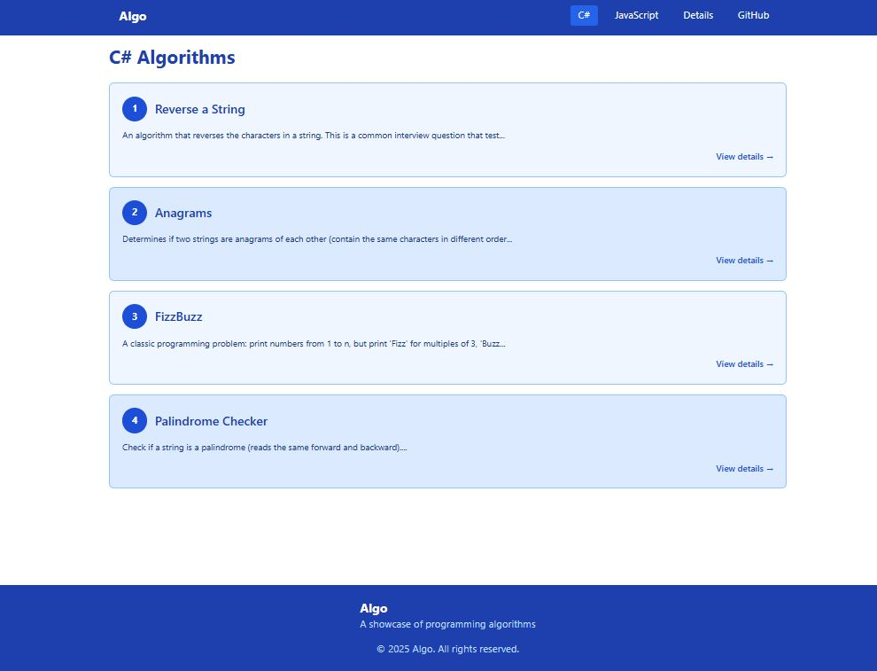
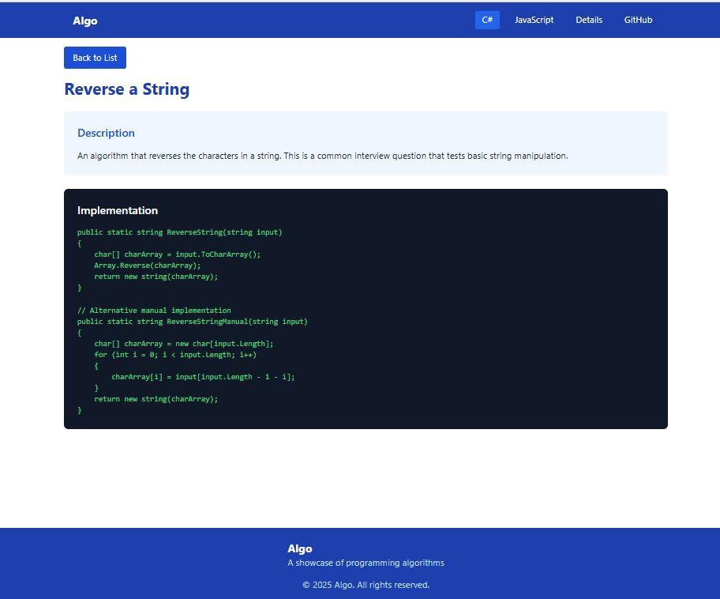

# Rapid Training and AI Showcase Demo

A modern React application that demonstrates rapid training quizzes, ai showcase and various algorithms implemented in both C# and JavaScript. The application provides an interactive interface for exploring and understanding different algorithms through clean visualization and detailed explanations.

frontend: https://rapid-training-ai.vercel.app/

backend: https://rapid-training-api.vercel.app/api/sql/show%20me%20all%20customers

## 📸 Screenshots





## ✨ Features

- **Dual Language Support**: Implementations in both C# and JavaScript
- **Interactive UI**: Modern, responsive interface built with Material-UI
- **Algorithm Categories**: Easy navigation between different algorithm implementations
- **Detailed Explanations**: Comprehensive breakdowns of each algorithm
- **Mobile Responsive**: Fully responsive design that works on all devices

## 🚀 Tech Stack

- React
- TypeScript
- Material-UI (MUI)
- React Router
- Modern CSS-in-JS styling

## deploy backend in vercel
vercel --prod

## deploy frontend in vercel
push commit to github

## 🛠️ Setup and Installation

1. Clone the repository:
```bash
git clone [repository-url]
```

2. Install dependencies:
```bash
npm install
```

3. Start the development server:
```bash
npm start
```

The application will be available at `http://localhost:3000`

## 📁 Project Structure

```
src/
  ├── components/     # Reusable UI components
  ├── data/          # Algorithm data and configurations
  ├── pages/         # Main application pages
  ├── styles/        # Theme and global styles
  └── types/         # TypeScript type definitions
```

## 🤝 Contributing

Contributions are welcome! Feel free to submit pull requests, report bugs, or request new features.

## 📝 License

This project is licensed under the MIT License - see the LICENSE file for details.
